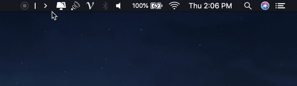

  

## Hidden Bar

Hidden Bar helps you hide menu bar items for a cleaner, more minimal macOS experience.

This project is a rewritten version of [dwarvesf/hidden](https://github.com/dwarvesf/hidden).

## Installation

- **Manual**: [Download the latest release](https://github.com/qvshuo/HiddenBar/releases/latest)

## Usage

- Press `⌘` and drag to rearrange hidden items in the menu bar.
- Click the arrow icon to toggle visibility of menu bar items.
- Hold `Option` and click to show or hide items that are always hidden.

  

## Requirements

- macOS 26.0 or later

## License

MIT
